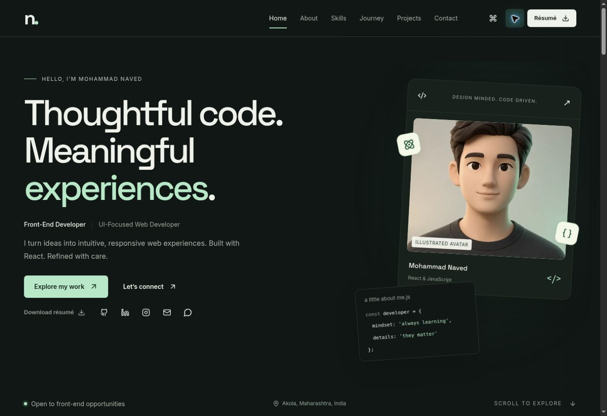
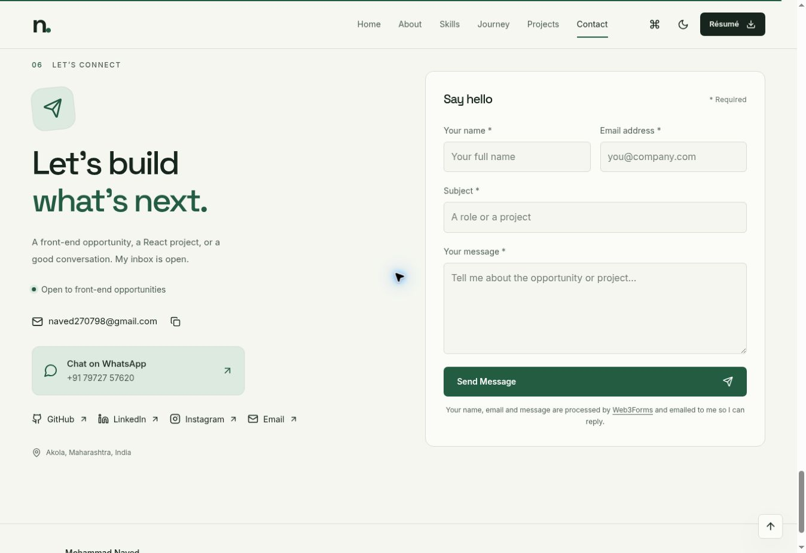

# Mohammad Naved — Developer Portfolio

Documentation updated: 26 September 2026. Includes the Naved Portfolio project-04 screenshot update and revised usage terms.

A complete, custom React + Vite single-page portfolio for Front-End / React Developer opportunities. Original plain CSS, charcoal and warm-white themes, mint accents, Space Grotesk headings, and locally hosted Inter body text.

**Copyright © 2026 Mohammad Naved. All rights reserved.**

This repository is publicly available for portfolio and demonstration purposes only. You may view the source code to evaluate my work. Reusing the project requires prior written permission, subject to the exceptions in [LICENSE](LICENSE). This project is not offered under an open-source license.

The setup, configuration, and deployment instructions below are for the repository owner and anyone with the necessary written permission. They do not grant permission to reuse the project.

## Included

- Responsive storytelling: introduction, selected projects, working approach, skills, learning journey, education, capabilities, and contact.
- System-aware dark/light mode with local preference persistence and no initial theme flash.
- Sticky navigation, scroll progress, active section tracking, mobile navigation, and back-to-top.
- Five centrally configured projects, category filters, native accessible case-study dialogs, lazy-loaded detail components, and broken-image fallbacks. Project 04 presents this Naved Portfolio with actual homepage and contact screenshots.
- Skill categories with Core / Comfortable / Familiar filtering; no invented percentages.
- Command palette with search, arrow-key navigation, Enter selection, and Escape dismissal.
- Ctrl/Cmd + K; opt-in D/P/C shortcuts that ignore form inputs. Enable single-key shortcuts in the command palette.
- Native modal focus containment, scroll locking, focus restoration, visible focus, skip link, and reduced-motion CSS.
- Web3Forms email delivery, validation, pending/success/error states, honeypot protection, and accessible notifications. WhatsApp click-to-chat and supplied social profiles are configured.
- Secure optional Express contact server with SMTP, server validation, rate limiting, honeypot, body size limits, Helmet, origin restrictions, and safe error responses.
- A working one-page résumé at `public/resume.pdf`, based only on supplied education, skills, and personal projects.
- Optional GitHub repository section using the public API; hidden until configured. It never fabricates contribution or follower counts.
- Build-generated structured data, canonical metadata and sitemap when a public origin is configured, a favicon, and robots.txt.
- Error boundary, self-hosted fonts, purposeful CSS motion, and split project/command/GitHub chunks.
- A quiet developer easter egg: type `naved` outside a form.

No Tailwind, Bootstrap, component framework, React Router, Redux dependency, or animation framework is used. Tailwind and Bootstrap appear only in the owner's skill list. Native anchors handle the single-page navigation; two small contexts handle theme and notifications. Optional cursor replacement, terminal, and PWA/service worker were omitted to keep navigation familiar and avoid cache maintenance.

## Quick start

Use Node.js 22 or newer and npm.

Extract `Naved-Portfolio.zip`, then open a terminal in the extracted `naved-portfolio` folder. In a terminal opened beside that folder:

```bash
cd naved-portfolio
npm install
npm run dev
```

The configured Web3Forms contact form and contact links work without creating a local environment file. No Node email server is needed for the default mode. Internet access is required to install dependencies and submit messages.

Open `http://localhost:4173`. The server binds to all interfaces for device testing; use a trusted local network.

```bash
npm run build
npm run preview
```

`dist/` is the production frontend. The included lockfiles allow reproducible installs with `npm ci` and `npm --prefix server ci`.

## Configure your content

Start with **`src/data/portfolioData.js`**. It imports the other data files and is the single entry point used by UI components.

| Content | Setting / file |
| --- | --- |
| Name, title, intro, location | `portfolioData.js` |
| Email | `portfolio.email` (public contact address) |
| GitHub / LinkedIn / Instagram URLs | `portfolio.social` (configured profile URLs) |
| WhatsApp number and greeting | `portfolio.whatsapp` |
| Photo | `portfolio.profile.image`; place the asset in `public/images/` and use `/images/your-photo.webp` |
| Availability | `portfolio.availability.enabled` and `.text` |
| Résumé | Replace `public/resume.pdf`; update `portfolio.resume` only if changing its URL or filename |
| Projects and case studies | `src/data/projects.js` |
| Skills | `src/data/skills.js` |
| Learning journey and education | `src/data/experience.js` |
| About, capabilities, achievements | `portfolioData.js`; empty achievements are hidden |
| Optional GitHub repositories | `portfolio.github.enabled` and `.username` |
| Palette, fonts, spacing tokens | `src/styles/variables.css` |

External links are rendered only when populated. Never put `#` in place of an unknown URL. Use complete `https://` URLs. GitHub project source buttons and live-demo buttons appear automatically when their values are supplied.

The profile uses an optimized illustrated dummy avatar, labeled as such. Set `portfolio.profile.placeholder=false` when replacing it with your professional photo. The MN monogram remains an image-load fallback. Project 04 is **Naved Portfolio**, replacing the earlier CMS entry. Its case study includes actual dark-homepage and light-contact screenshots, with details about Web3Forms email submission, WhatsApp click-to-chat, themes, responsive layouts, and keyboard navigation. Other project visuals remain labeled **Interface concept**; they are illustrative UI previews rather than actual screenshots. Review their editable descriptions before sending the portfolio to recruiters. Map + Excel remains marked **Planned exploration**.

The résumé intentionally contains no invented email, phone, usernames, employment, metrics, or awards. Replace it with your final contact-complete résumé before a public job application launch.

To add a project, add an object with the same fields as an existing project. Keep `id` unique and use one or more existing `category` values. Supply `image`, `imageAlt`, `github`, and `live` when available. Add a filter in `projectFilters` if introducing a category.

For a screenshot gallery, use the `screenshots` array in `src/data/projects.js`, with `src`, `label`, `alt`, and `caption` for each image. The Naved Portfolio entry is the reference example. Its `currentSite` flag adds an internal "Explore this portfolio" link without inventing an external demo or repository URL.

## Contact delivery

The deployed frontend uses **Web3Forms**. `portfolio.contact.provider` is `web3forms`, and the public form access key is configured centrally. The visitor completes Name, Email, Subject, Message and clicks **Send Message**. The browser submits HTTPS JSON directly to `https://api.web3forms.com/submit`; Web3Forms routes it to the Gmail address associated with that key. The visitor's email becomes Reply-To. No Gmail login or separately deployed Express server is required.

The UI reports success only when Web3Forms returns `success: true`. This acknowledges submission, not guaranteed inbox placement. Confirm actual receipt in Gmail, checking Spam as well. No email is sent automatically on page load. Do not put Gmail passwords, OTPs, or private API credentials in this project.

The public Web3Forms form key is intentionally browser-visible and is not a Gmail credential. An optional `VITE_WEB3FORMS_ACCESS_KEY` overrides the configured key. Empty overrides retain the central value. The hidden honeypot maps to Web3Forms `botcheck`; Web3Forms also applies its own spam filtering. This is not a guarantee against spam. If abuse occurs, enable hCaptcha in Web3Forms and add its matching client integration; domain restrictions require an eligible paid plan. No paid plan or external account setting was changed.

Submissions are not logged or saved by this frontend; Web3Forms processes the submitted fields and emails them to the owner. A visitor-facing disclosure links to the provider's privacy policy. Timeout errors preserve the message and warn that delivery may be uncertain before retrying. Repeat clicks are blocked while sending.

The optional Express implementation remains available: change `portfolio.contact.provider` to `server` and configure `VITE_CONTACT_ENDPOINT`. With that provider, an empty endpoint retains the email-app/draft fallbacks. Web3Forms mode never silently changes to a draft download.

## Contact links

Public email, LinkedIn, GitHub, Instagram and WhatsApp use the supplied identities. The Instagram URL omits its sharing query. WhatsApp uses `https://wa.me/` with international digits and an encoded greeting; opening the link does not send the greeting automatically. The number is accessible in the link even if only an icon is shown. No WhatsApp API key is needed.

## Environment variables

To override the default public settings, copy `.env.example` to `.env` at the project root. In Git Bash/macOS/Linux use `cp .env.example .env`; in PowerShell use `Copy-Item .env.example .env`.

| Frontend variable | Purpose |
| --- | --- |
| `VITE_WEB3FORMS_ACCESS_KEY` | Optional public Web3Forms form-key override; never a Gmail credential |
| `VITE_CONTACT_ENDPOINT` | Complete contact URL, e.g. `http://localhost:3001/api/contact` during development |
| `VITE_SITE_URL` | Public canonical origin, e.g. `https://your-domain.com`, with no path; used during build for canonical, Open Graph URL, and sitemap |

These are public build-time settings. **Never put SMTP credentials or private API keys in a `VITE_` variable.** Restart development after changing `.env`; rebuild after changing production variables.

For the existing hosted address, the canonical setting is:

```dotenv
VITE_SITE_URL=https://naved-frontend-portfolio.allentown021.chatgpt.site
```

Use the actual new domain instead when deploying elsewhere. The export excludes local environment files, so set this variable again for a production build.

When `VITE_SITE_URL` is empty, canonical URL and sitemap are omitted instead of publishing a fake domain. `robots.txt` remains valid. Open Graph and X title/description metadata are included; no social image is claimed until you add one.

## Optional Node / Express server

In a second terminal:

```bash
cd server
npm install
cp .env.example .env
npm run dev
```

PowerShell users can replace `cp` with `Copy-Item`. Fill `server/.env` with your own provider's settings. Set `portfolio.contact.provider` to `server` and the frontend `VITE_CONTACT_ENDPOINT=http://localhost:3001/api/contact`, then restart the frontend.

| Server variable | Purpose |
| --- | --- |
| `NODE_ENV` | `development`, `test`, or `production`; production refuses to start with incomplete mail settings |
| `PORT` | HTTP port, default `3001` |
| `ALLOWED_ORIGINS` | Comma-separated exact frontend origins, no trailing slashes or wildcard |
| `TRUST_PROXY_HOPS` | Trusted reverse-proxy hop count; defaults to zero. Configure from your hosting provider's network topology |
| `SMTP_HOST` | Provider SMTP hostname |
| `SMTP_PORT` | Usually 587 with STARTTLS or 465 with implicit TLS; use provider guidance |
| `SMTP_SECURE` | `true` for implicit TLS, typically port 465; `false` uses required STARTTLS |
| `SMTP_USER` | SMTP account / provider user |
| `SMTP_PASSWORD` | SMTP password or provider app credential |
| `EMAIL_FROM` | Provider-authorized sender address |
| `EMAIL_TO` | Your receiving address |

The visitor is set as `replyTo`, never as the authenticated sender. Email content is plain text; HTML is not evaluated. Headers reject control characters. No message body, email address, credentials, or stack traces are logged. Errors use stable internal codes.

Endpoints:

- `GET /api/health`: `{ ok: true, deliveryConfigured: boolean }`
- `POST /api/contact`: `{ name, email, subject, message, website }`; `website` is the honeypot and should be empty.

Messages allow 20–5,000 characters; JSON bodies are limited to 12 KB; the contact endpoint allows five requests per IP per 15 minutes. CORS is not authentication and the endpoint remains public. The in-memory limiter is appropriate for one server instance; use a shared rate-limit store before horizontal scaling. There is no database or admin interface.

## Deployment

### Vercel frontend

Import the repository, use the Vite framework preset, the repository root, `npm run build`, and `dist`. `vercel.json` includes these build settings and basic security headers. Set `VITE_SITE_URL` to your deployed origin. Optionally set `VITE_WEB3FORMS_ACCESS_KEY` to override the existing public form key. Leave `VITE_CONTACT_ENDPOINT` empty for Web3Forms mode, then deploy.

### Netlify frontend

Import the repository. `netlify.toml` specifies `npm run build` and `dist`. Set `VITE_SITE_URL` to your deployed origin. The supplied Web3Forms key is already configured; `VITE_WEB3FORMS_ACCESS_KEY` is an optional override. Deploy the frontend without the Express service when using Web3Forms.

There are no client-side pathname routes, so neither provider needs an SPA rewrite or `_redirects`. Links such as `/#projects` load the root document correctly. If you later add React Router, add provider-specific fallback rewrites and an actual 404 route together.

### Express service

Run the `server/` directory as a separate Node web service on a host supporting Node and SMTP egress, such as Render, Railway, or your VPS. Use `npm ci` to install and `npm start` to serve. Set `NODE_ENV=production`, configure SMTP secrets through the host, set the exact frontend origin in `ALLOWED_ORIGINS`, and set proxy trust according to the host. Use HTTPS. Point `VITE_CONTACT_ENDPOINT` to the resulting `/api/contact` URL and rebuild the frontend.

The downloadable Express service is **not** hosted by the static frontend deployment. The private portfolio uses Web3Forms directly; the Express service is not deployed or required for this mode. The receiving address must match the Web3Forms form key configuration.

Official references: [Vite production deployment](https://vite.dev/guide/static-deploy), [Express security practices](https://expressjs.com/en/advanced/best-practice-security/), [Nodemailer SMTP](https://nodemailer.com/smtp).

## Validation

```bash
npm run lint
npm test
npm --prefix server install
npm run test:server
npm run build
```

Backend tests use an injected test mailer; they never send real email. Tests cover validation, origin checks, header injection, content types, malformed JSON, body limits, rate limits, honeypot behavior, missing configuration, and delivery failure.

For manual layout review during `npm run dev`, visit `/tests/responsive.html`. Select 320, 375, 425, 768, 1024, 1280, 1440, or 1920 px. This development-only harness reports content width and hosts the real application in an iframe. It is not included in the production output. Also verify on real Android and iOS devices before public release; an iframe is not a device emulator.

See [validation notes](docs/VALIDATION.md) for checks completed and remaining integration limits. No Lighthouse score is claimed without an actual audit.

## Screenshots and images

Available in the project after applying the project-04 update:

- `docs/screenshots/contact-dark.jpg`: the updated contact section from the browser review.
- `public/images/avatar-placeholder.webp`: optimized, clearly labeled dummy avatar.
- `public/images/projects/naved-portfolio-overview.jpg`: actual portfolio homepage in dark mode.
- `public/images/projects/naved-portfolio-contact.jpg`: actual contact section in light mode, including the Send Message form and WhatsApp link.
- `public/resume.pdf`: the existing draft résumé; replace it with your final résumé.





The remaining project visuals are labeled interface concepts. No professional photo has been added. These screenshots show the interface; they do not establish receipt of a test email in Gmail.

## Folder structure

```text
naved-portfolio/
  public/
    images/avatar-placeholder.webp
    images/projects/naved-portfolio-overview.jpg
    images/projects/naved-portfolio-contact.jpg
    licenses/                    # Bundled font licenses
    favicon.svg
    resume.pdf
    robots.txt
  src/
    components/                  # Sections, dialogs and shared UI
    context/                     # Theme and toast providers
    hooks/                       # Reveal, navigation and shortcuts
    data/                        # Personal content and collections
    styles/                      # Theme tokens, layout and animation
    utils/
      contact.js                 # Validation and optional draft helpers
      links.js                   # WhatsApp URL formatting
      sendContact.js             # Web3Forms / optional server delivery
    App.jsx
    main.jsx
  server/
    src/                         # Optional Express / SMTP service
    tests/contact.test.js
    .env.example
    package.json
    package-lock.json
  scripts/generate-seo.mjs
  tests/
    contact.test.mjs
    sendContact.test.mjs
    responsive.html
  docs/
    screenshots/contact-dark.jpg
    VALIDATION.md
    RELEASE.md
  .env.example
  .gitignore
  eslint.config.js
  index.html
  netlify.toml
  package.json
  package-lock.json
  vercel.json
  vite.config.js
  README.md
  LICENSE
```

## Design and customization

Change the two theme token sets in `variables.css` for a new palette. `components.css` contains labeled sections; responsive rules sit near its end. Main content widths use a shared container, grid/flex layouts, fluid heading sizes, and explicit small-screen compositions. Fonts are bundled from Fontsource and require no Google Fonts request. Replace the dummy avatar and project screenshot paths through the central configuration without changing components.

Animations use CSS transforms/opacity and IntersectionObserver. OS reduced-motion preference removes motion, and touch layouts disable ambient floating. Native scrolling is retained. Rotating roles stop while the document is hidden and respect reduced motion. All content remains visible if IntersectionObserver is unavailable.

## License

**Copyright © 2026 Mohammad Naved. All rights reserved.**

This repository is publicly available for portfolio and demonstration purposes only.

You may view the source code. Except as permitted by applicable law, the applicable GitHub Terms of Service, or a separate license governing particular material, you may not copy, modify, redistribute, sell, publish, sublicense, deploy, or use this code in your own projects without prior written permission from Mohammad Naved.

Permission requests: [naved270798@gmail.com](mailto:naved270798@gmail.com).

Read [LICENSE](LICENSE) for the complete notice, scope, and exceptions. This project is not offered under an open-source license.

### Public GitHub repository

Making this repository public allows viewing and forking within GitHub under its Terms of Service. This notice does not override those platform rights or uses permitted by law. Public visibility does not grant additional permission to reuse the project beyond those rights. A notice cannot technically prevent someone from downloading or copying publicly accessible code.

### Third-party materials and earlier permissions

This notice applies only to material to the extent that Mohammad Naved holds the relevant rights. Third-party dependencies, fonts, icons, images, and other separately licensed materials retain their own licenses and required notices. Preserve the bundled font license files in `public/licenses/` and all other required attributions.

This notice does not revoke valid permissions previously granted for earlier copies under another license or a separate written agreement.

Reference: [GitHub guidance on licensing public repositories](https://docs.github.com/en/repositories/managing-your-repositorys-settings-and-features/customizing-your-repository/licensing-a-repository).
